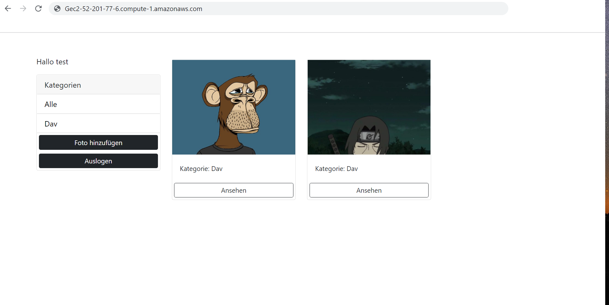

# Album-app on EC2-Ubuntu (AWS) 

The goal of the project it s build telegram-bot , which can exchange with you just by writting specials commands on telegram. 
One of them , give you an acces to your album-app .


## Telegram


## On Ec2


## Results





## How to deploy the Django-app on EC2
 
with
```cmd 
Create and Launch your own EC2 instance (Ubuntu Server 20.04 amd64, SSD T3.nano )


sudo apt-get update -y
sudo apt-get upgrade -y
sudo apt-get install gcc
sudo apt-get install nginx
sudo apt install -y python3-pip python3-dev nginx curl
sudo pip3 install --upgrade pip3 


sudo pip3 install virtualenv
virtualenv demo_venv
source demo_venv/bin/activate


Upload codebase on EC2 instance ihre Django-app

git clone git://github.com/


pip3 freeze > requirements.txt

python -m pip install Django

pip install django-storages

python -m pip install Pillow

gunicorn --bind 0.0.0.0:8000 --workers 3 photoshare.wsgi 

```


## Here we let Autostart the Gunicorn server

```cmd 

sudo nano /etc/systemd/system/gusudo systemctl daemon-reload

[Unit]
Description=gunicorn daemon
Requires=gunicorn.service
After=network.target
[Service]
User=ubuntu
Group=www-data
WorkingDirectory=/home/ubuntu/django-locallibrary-tutorial
ExecStart=/home/ubuntu/demo_venv/bin/gunicorn --workers 3 \
--threads 7 --bind localhost:8000 --access-logfile - \
locallibrary.wsgi
[Install]
WantedBy=multi-user.target


sudo systemctl start gunicorn
sudo systemctl status gunicorn
sudo systemctl enable gunicornnicorn.service


sudo nano /etc/nginx/sites-available/demo_project

server {
listen 80;
server_name server_domain_or_IP;
location = /favicon.ico { access_log off; log_not_found off; }
location /static/ {
root /home/ubuntu/photoshare/staticfiles }
location / {
include proxy_params;
proxy_pass http://localhost:8000;
}
}


sudo ln -s /etc/nginx/sites-available/demo_project /etc/nginx/sites-enabled ##
sudo nginx -t ## test nginx config
sudo systemctl restart nginx
```
